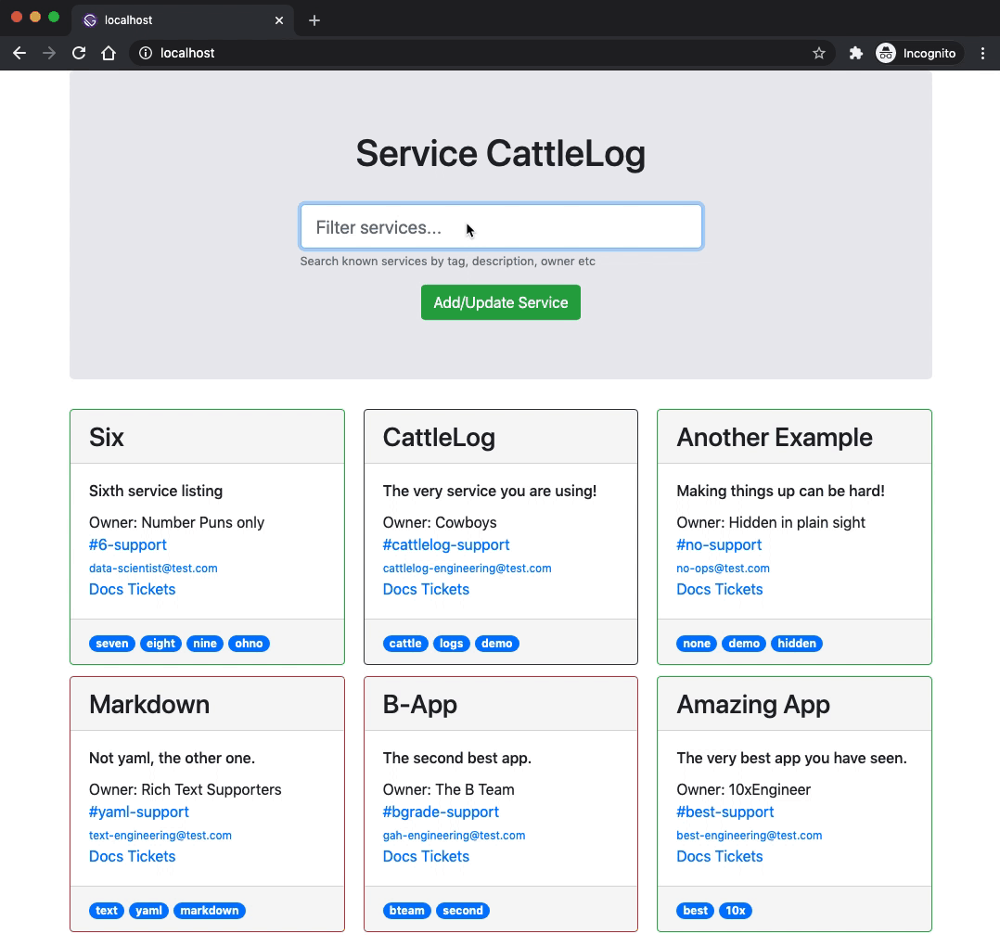

# POC Service CattleLog

A basic service listing/catalog - provides links to team chat channels and service documentation.

This is tagged as a Proof of Concept, primarily this served as an introduction to Gatsbyjs and React (with bootstrap thrown in).

## Service definitions

Services are defined as Markdown in ./src/markdown-services/.

Each service is its own markdown (.md) file with a specific set of frontmatter fields specified.

The Gatsby build process will iterate and import all files within this directory.

### Adding or Updating a service

To add (or update) a service, simply create (or update) the required .md file within the dir.

Use the next section to confirm your service correctly renders as desired.

Then commit your changes to a new branch and submit a merge request to this repo.

Upon review, approval and merge - a new docker image will be built and deployed.

## Build and test locally

To build the image locally, you can run:
`docker build -t cattlelog/test .`

and then run the image with:
`docker run --rm -p 80:8080 cattlelog/test`

Then browse to `http://localhost` to view the content.